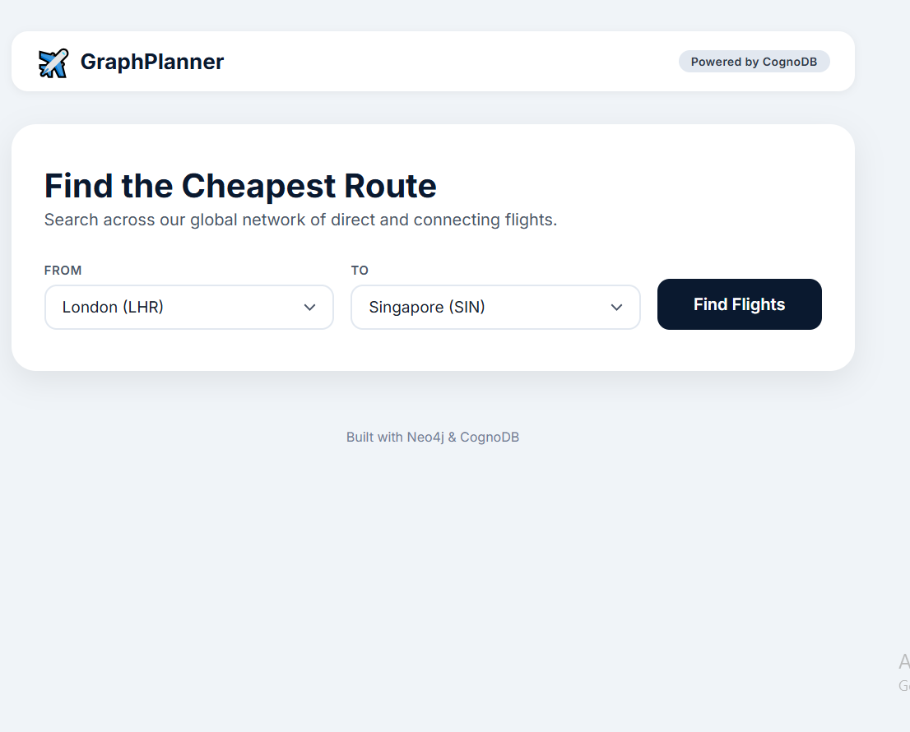
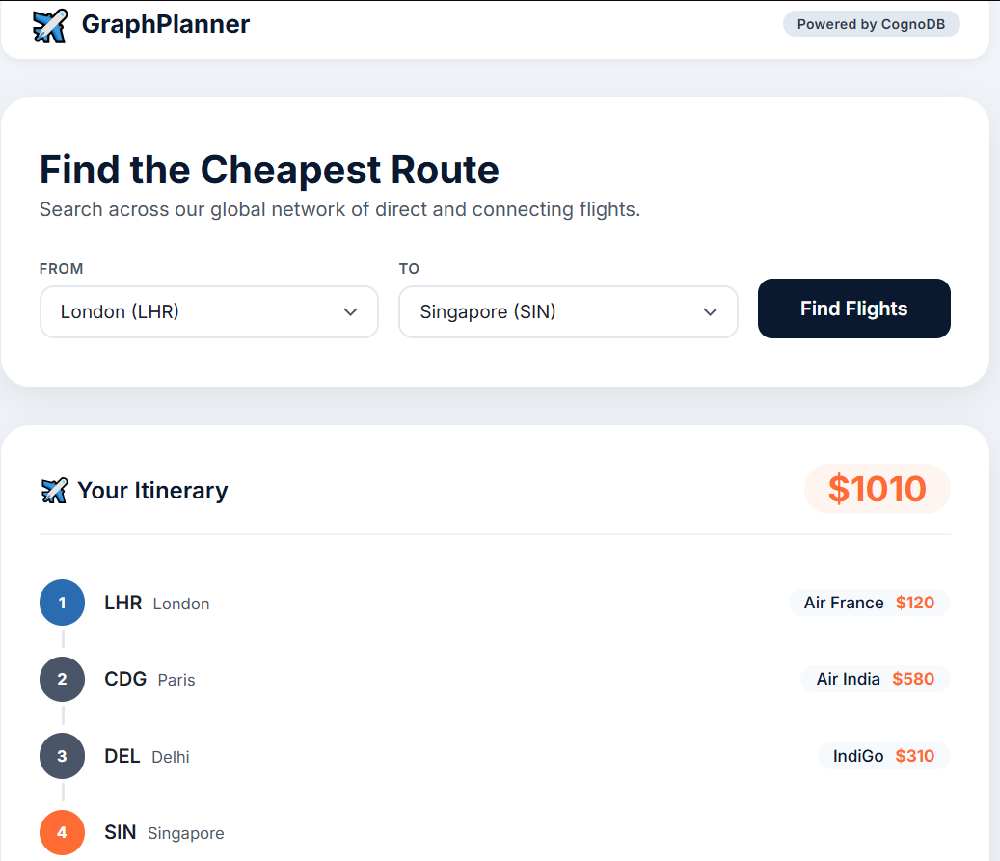
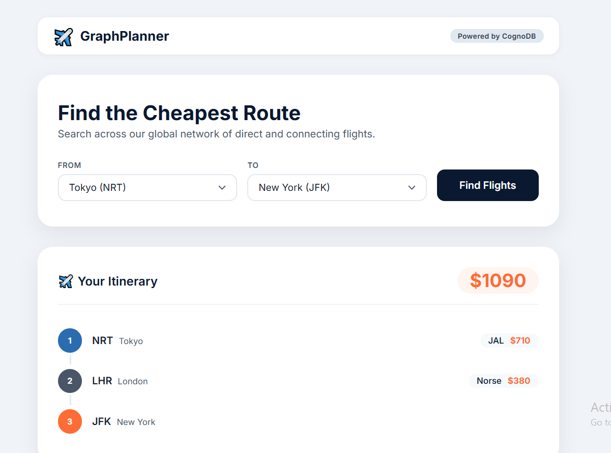
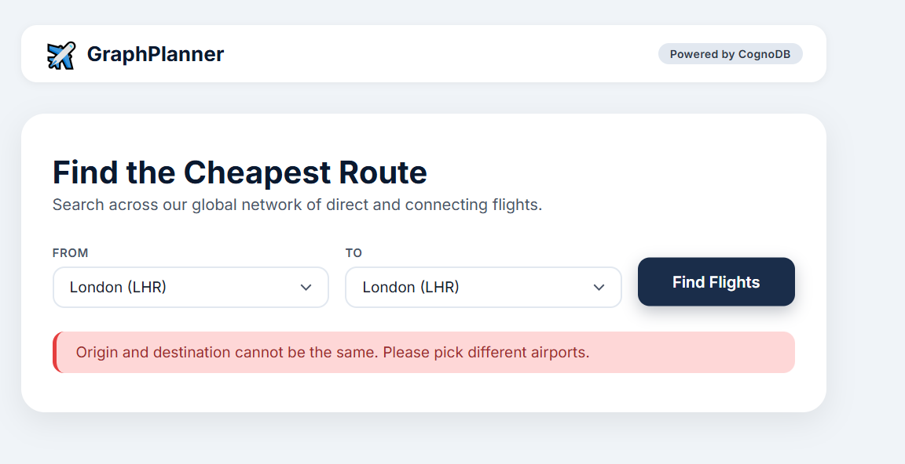

# ✈️ GraphPlanner – CognoDB Travel Route Finder

> A full-stack web application built with CognoDB (Neo4j) and Node.js that finds the cheapest flight routes between airports using multi-hop graph traversal.

---

## 📖 Table of Contents

- [Use Case](#-use-case)
- [Why a Graph Database?](#-why-a-graph-database)
- [Data Model](#-data-model)
- [Live Demo](#-live-demo)
- [Setup & Installation](#-setup--installation)
- [Main Cypher Queries Explained](#-main-cypher-queries-explained)
- [Screenshots](#-screenshots)
- [Tech Stack](#-tech-stack)

---

## 🎯 Use Case

**The Problem:** Travelers looking for connecting flights often have to check multiple airlines and booking sites. Finding the cheapest combination of flights with layovers requires complex searching across many combinations.

**The Solution:** GraphPlanner lets users select any two airports from a global list. In under a second, it calculates the **absolute cheapest route** (including up to 4 connecting flights), displays the total cost, and shows a step-by-step timeline of the journey, including airline names and leg-by-leg prices.

---

## 🧠 Why a Graph Database?

**In a Relational (SQL) Database:**
Finding a route with just _two_ layovers requires joining the `flights` table to itself 3 times:

```sql
SELECT * FROM flights f1
JOIN flights f2 ON f1.destination = f2.origin
JOIN flights f3 ON f2.destination = f3.origin
WHERE f1.origin = 'LAX' AND f3.destination = 'SIN';
```

---

## 🗺️ Data Model

graph LR
A[Airport] -->|HAS_FLIGHT| B[Airport]

    style A fill:#0a192f,color:#fff,stroke:#333,stroke-width:2px
    style B fill:#0a192f,color:#fff,stroke:#333,stroke-width:2px

### Nodes: `Airport`

| Property  | Type   | Description                     |
| :-------- | :----- | :------------------------------ |
| `code`    | String | IATA airport code (e.g., "LHR") |
| `city`    | String | Full city name                  |
| `country` | String | Country name                    |

### Relationships: `HAS_FLIGHT`

| Property   | Type    | Description              |
| :--------- | :------ | :----------------------- |
| `airline`  | String  | Operating airline        |
| `price`    | Integer | Ticket price in USD      |
| `distance` | Integer | Flight distance in miles |

---

## 🌐 Live Demo

**[Click here to try the live application](https://travel-planner-xazq.onrender.com)**

---

## 🛠️ Setup & Installation

### Prerequisites

- **Node.js** (v18 or higher) – [Download here](https://nodejs.org/)
- **CognoDB Cloud** (free tier) – [Sign up here](https://console.cognodb.com/signup)

---

### Step 1: Clone the repository

```bash
git clone https://github.com/tobajetex/travel-planner.git
cd travel-planner
```

---

### Step 2: Install dependencies

```bash
npm install
```

---

### Step 3: Set up CognoDB Cloud

1. Go to the [CognoDB Console](https://console.cognodb.com/signup) and create an account.
2. Click **"Create Instance"** and choose the **free (c0)** tier.
3. Select a region near you and wait ~60 seconds for it to provision.
4. **Crucial:** Copy the connection credentials shown exactly once:
   - **Connection URI:** `bolt+s://<your-instance-id>.databases.cognodb.cloud`
   - **Username:** `cognodb` (Notice: this is NOT "neo4j").
   - **Generated Password:** (Save this immediately to a notepad).

---

### Step 4: Configure Environment Variables

Create a `.env` file in the root of your project and paste the following, filling in your actual CognoDB details:

```env
NEO4J_URI=bolt+s://your-instance-id.databases.cognodb.cloud
NEO4J_USER=cognodb
NEO4J_PASSWORD=your-saved-password
PORT=3000
```

---

### Step 5: Seed the database

Run the seed script to populate your CognoDB instance with 9 major airports and 15 realistic flight routes:

```bash
npm run seed
```

_Expected output:_ `🎉 Seed completed successfully! Your CognoDB instance is ready.`

---

### Step 6: Run the application locally

Start the Express server:

```bash
npm start
```

Open your browser and navigate to [http://localhost:3000](http://localhost:3000). You should see the travel planner interface.

## 🔍 Main Cypher Queries Explained

### The Star Query: Cheapest Route with Multi-Hop Traversal

This is the query that demonstrates the true power of a graph database. It finds the cheapest path between two airports, allowing up to 4 flight segments (`*1..4`).

**The Cypher Query (from `src/controllers/flightController.js`):**

```cypher
MATCH path = (start:Airport {code: $from})-[:HAS_FLIGHT*1..4]-(end:Airport {code: $to})
WITH path,
     reduce(totalCost = 0, flight IN relationships(path) | totalCost + flight.price) AS totalCost,
     [flight IN relationships(path) | flight.airline] AS airlines,
     [node IN nodes(path) | node.code] AS stops,
     [node IN nodes(path) | node.city] AS cityStops
RETURN totalCost, airlines, stops, cityStops
ORDER BY totalCost ASC
LIMIT 1
```

**Why this is powerful (and why SQL struggles):**

1. **Variable-Length Path (`*1..4`):** This tells the database to find paths of length 1, 2, 3, or 4 relationships deep. In SQL, you would have to write a separate `UNION` query for 1-hop, 2-hop, 3-hop, and 4-hop routes, each with increasingly complex self-joins.

2. **`reduce()` Function:** This dynamically sums the `price` property across _every_ relationship found in the path, regardless of how long the path is. No hard-coded column names are needed.

3. **Deconstructing the Path (`relationships(path)` and `nodes(path)`):** This extracts the individual airlines and airport codes so the frontend can render a beautiful step-by-step timeline for the user.

---

## 📸 Screenshots

### 1. Homepage – Airport Selection



### 2. Search Result – Itinerary Timeline



### 3. Empty State – No Route Found

_Note: The dataset is fully connected, so for valid airport selections, a route is always found within 4 hops. This screenshot demonstrates the empty state UI when the hop limit is temporarily reduced for demonstration purposes._



### 4. Error State – Same Airport Selected



---

## 💻 Tech Stack

- **Database:** CognoDB Cloud (Neo4j-compatible graph database)
- **Backend:** Node.js, Express.js, Neo4j JavaScript Driver
- **Frontend:** HTML5, CSS3,Vanilla JavaScript (ES6+)
- **Deployment:** Render.com (free tier)
- **Version Control:** Git & GitHub

---

## 👤 Author

**OLORUNTOBA JETHRO JETAWO**  
[GitHub](https://github.com/tobajetex)

---
